---
## Author
author:
  name: Абронина Алиса Кирилловна
  degrees: DSc
  orcid: 0000-0002-0877-7063
  email: 1132246717@rudn.ru
  affiliation:
    - name: Российский университет дружбы народов
      country: Российская Федерация
      postal-code: 117198
      city: Москва
      address: ул. Миклухо-Маклая, д. 6
## Title
title: Внешний курс. Блок 1
subtitle: Безопасность и сети
license: CC BY
date: today
date-format: "YYYY-MM-DD" # Example: 2025-09-06
---

# Информация

## Докладчик

:::::::::::::: {.columns align=center}
::: {.column width="70%"}

  * Абронина Алиса Кирилловна
  * НКАбд-01-24
  * Российский университет дружбы народов им. П. Лумумбы
  * [1132246717@rudn.ru](mailto:1132246717@rudn.ru)
  * <https://github.com/akabronina>

:::
::: {.column width="30%"}

:::
::::::::::::::

# Цель работы

Выполнение заданий первого блока внешнего курса.

# Выполнение заданий первого блока

TCP - протокол транспортного уровня HTTPS 

---

TCP - transmission control protocol - работает на транпортном уровне 

---

В адресе IPv4 не может быть чисел больше 255 

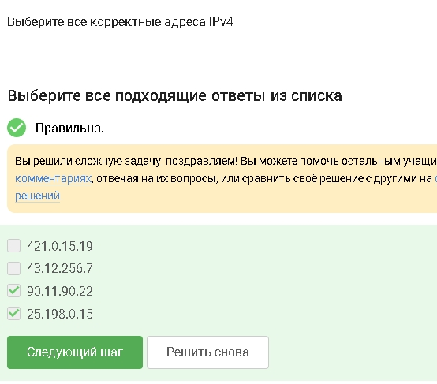

---

DNS(Domain name server)-сервер, у которого обызательное условие - сопоставление сервером доменных имен доменного имени с IP-адресом называется разрешением имени и адреса

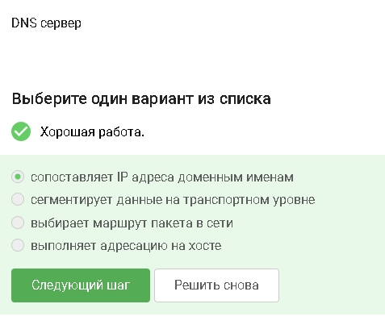

---

Распеределние протокол в модели TCP/IP: прикладной уровень, траспортный уровень, сетевой, уровень сетевого доступа 

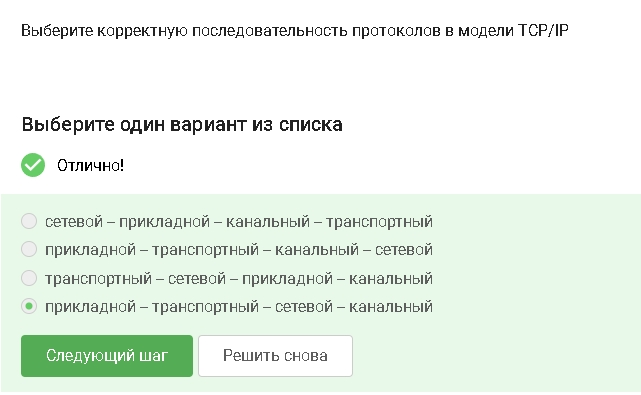

---

Протокол http передает незашифрованные данные, а протокол https передает зашифрованные данные 

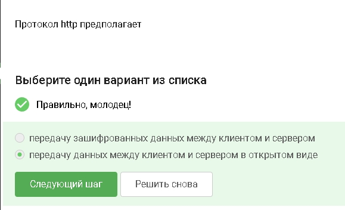

---

https передает зашифрованные данные, одна из фаз - передача данных, другая должна быть рукопожатием 

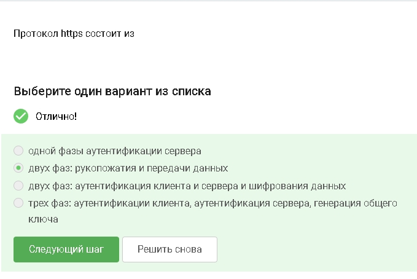

---

TLS определяется и клентом, и сервером, чтобы было возможно подключиться 

---

Во время рукопожатия стороны только договариваются: кто они, какие алгоритмы использовать и как получить общий ключ. Само шифрование данных начинается после handshake 

---

Пароль обычно не хранят из соображений безопасности. IP-адрес хранит сервер, а не cookie 

---

Куки нужны для авторизации, персонализации, статистики и трекингаЮ но не влияют на качество соединения 

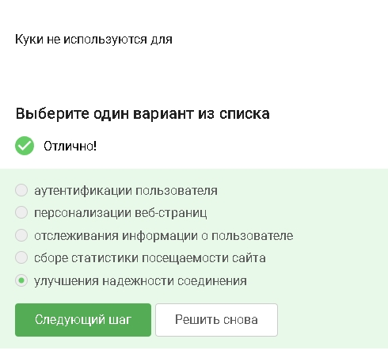

---

Сервер отправляет браузеру заголовок 'Set-Cookie'

---

Да, на время ползования веб-сайтом. Они удаляются после закрытия сессии 

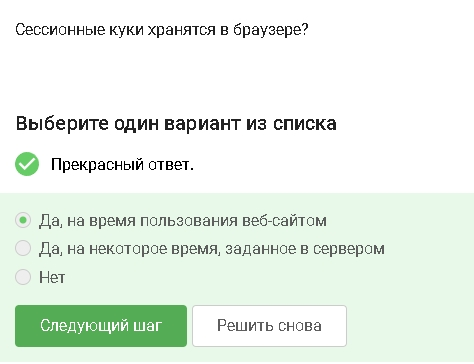

---

Цепочка обычно: охранный промежуточный вызодной 

---

Остальные узлы знают только соседей по цепочке 

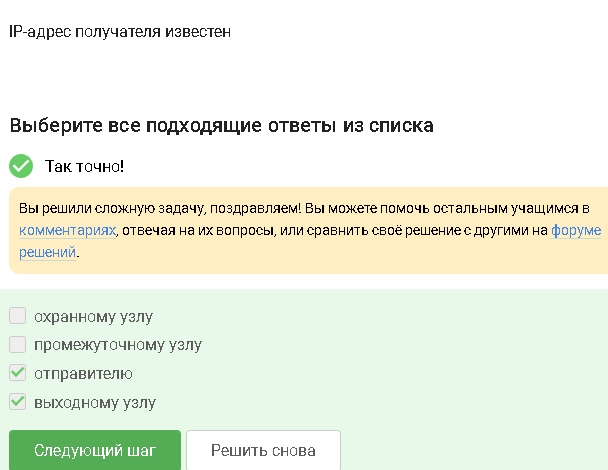

---

Для каждого узла создается свой ключ шифрования 

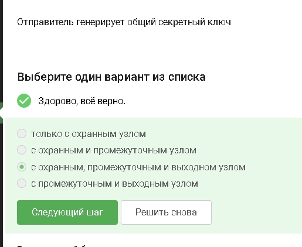

---

Получатель видит обычное соединение от выходного узла TOR

---

Это стандарт беспроводной связи 

---

Вай фай относится к канальному уровню модели OSI 

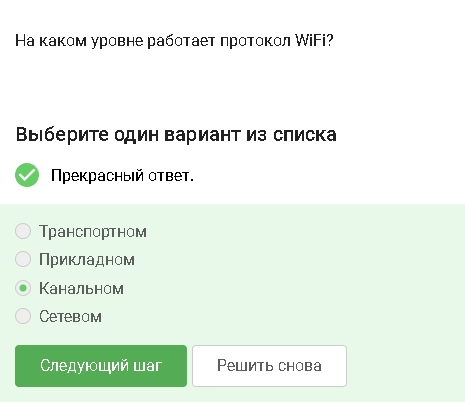

---

Устаревший протокол с легко взламываемым шифрованием 

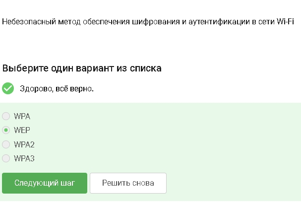

---

Сначала устройство проходит проверку, потом включается шифрование 

---

Для дома используется общий пароль. WPA2 Enterprise для организаций с сервером аунтетификации 

---

# Выводы

В ходе выполнения первого блока узнала о работе базовых сетевых протоколов, куки сетей вай фай и браузера тор.

