---
## Author
author:
  name: Абронина Алиса Кирилловна
  degrees: DSc
  orcid: 0000-0002-0877-7063
  email: 1132246717@rudn.ru
  affiliation:
    - name: Российский университет дружбы народов
      country: Российская Федерация
      postal-code: 117198
      city: Москва
      address: ул. Миклухо-Маклая, д. 6

## Title
title: "Внешний курс. Блок 1."
subtitle: "Безопасность и сети"
license: "CC BY"
---

# Цель работы

Выполнение заданий первого блока внешнего курса.

# Выполнение заданий первого блока

TCP - протокол транспортного уровня HTTPS ([рис. @fig-001]).

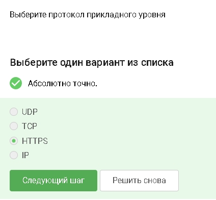{#fig-001 width=70%}

TCP - transmission control protocol - работает на транпортном уровне ([рис. @fig-002]).

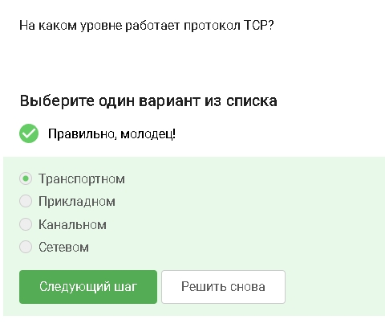{#fig-002 width=70%}

В адресе IPv4 не может быть чисел больше 255 ([рис. @fig-003]).

{#fig-003 width=70%}

DNS(Domain name server)-сервер, у которого обызательное условие - сопоставление сервером доменных имен доменного имени с IP-адресом называется разрешением имени и адреса ([рис. @fig-004]).

{#fig-004 width=70%}

Распеределние протокол в модели TCP/IP: прикладной уровень, траспортный уровень, сетевой, уровень сетевого доступа ([рис. @fig-005]).

{#fig-005 width=70%}

Протокол http передает незашифрованные данные, а протокол https передает зашифрованные данные ([рис. @fig-006]).

{#fig-006 width=70%}

https передает зашифрованные данные, одна из фаз - передача данных, другая должна быть рукопожатием ([рис. @fig-007]).

{#fig-007 width=70%}

TLS определяется и клентом, и сервером, чтобы было возможно подключиться ([рис. @fig-008]).

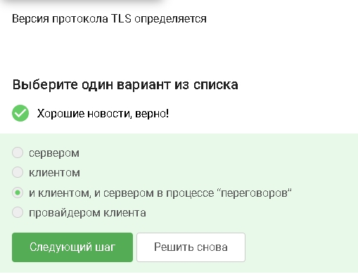{#fig-008 width=70%}

Во время рукопожатия стороны только договариваются: кто они, какие алгоритмы использовать и как получить общий ключ. Само шифрование данных начинается после handshake ([рис. @fig-009]).

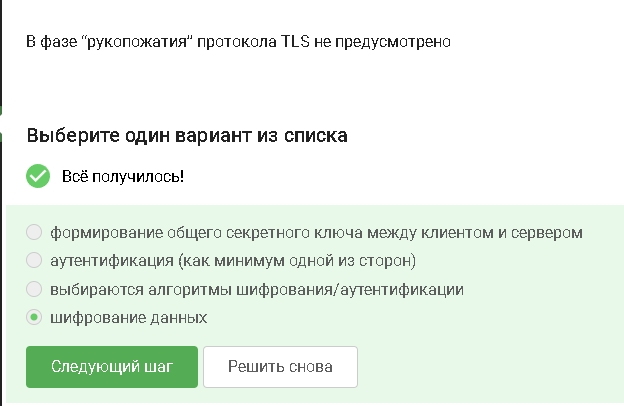{#fig-009 width=70%}

Пароль обычно не хранят из соображений безопасности. IP-адрес хранит сервер, а не cookie ([рис. @fig-010]).

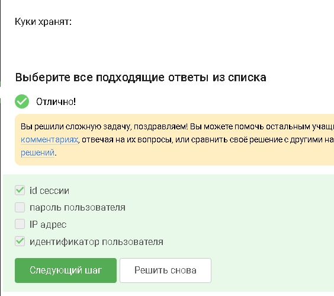{#fig-010 width=70%}

Куки нужны для авторизации, персонализации, статистики и трекингаЮ но не влияют на качество соединения ([рис. @fig-011]).

{#fig-011 width=70%}

Сервер отправляет браузеру заголовок 'Set-Cookie' ([рис. @fig-012]).

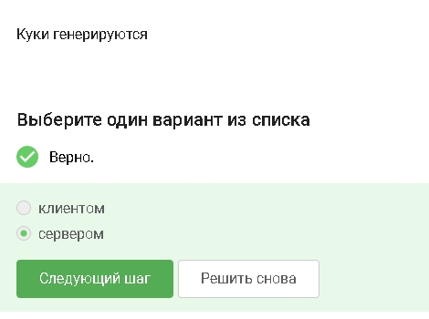{#fig-012 width=70%}

Да, на время ползования веб-сайтом. Они удаляются после закрытия сессии ([рис. @fig-013]).

{#fig-013 width=70%}

Цепочка обычно: охранный промежуточный вызодной ([рис. @fig-014]).

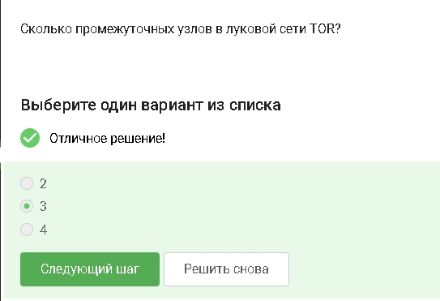{#fig-014 width=70%}

Остальные узлы знают только соседей по цепочке ([рис. @fig-015]).

{#fig-015 width=70%}

Для каждого узла создается свой ключ шифрования ([рис. @fig-016]).

{#fig-016 width=70%}

Получатель видит обычное соединение от выходного узла TOR([рис. @fig-017]).

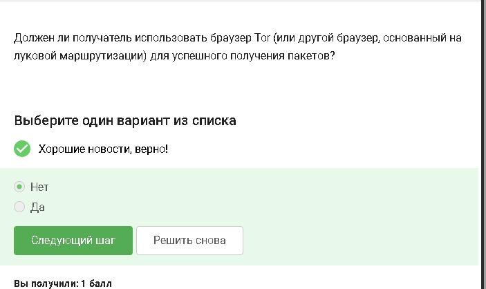{#fig-017 width=70%}

Это стандарт беспроводной связи ([рис. @fig-018]).

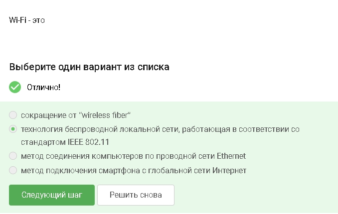{#fig-018 width=70%}

Вай фай относится к канальному уровню модели OSI ([рис. @fig-019]).

{#fig-019 width=70%}

Устаревший протокол с легко взламываемым шифрованием ([рис. @fig-020]).

{#fig-020 width=70%}

Сначала устройство проходит проверку, потом включается шифрование ([рис. @fig-020]).

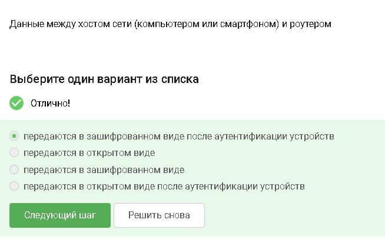{#fig-021 width=70%}

Для дома используется общий пароль. WPA2 Enterprise для организаций с сервером аунтетификации ([рис. @fig-022]).

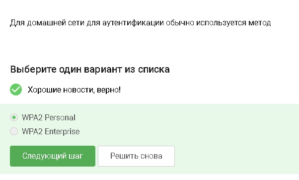{#fig-022 width=70%}

# Выводы

В ходе выполнения первого блока узнала о работе базовых сетевых протоколов, куки сетей вай фай и браузера тор.

