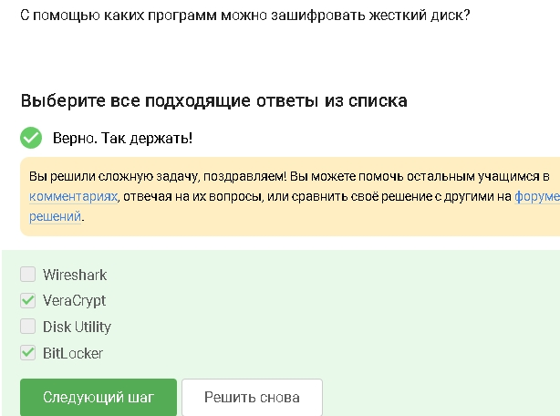
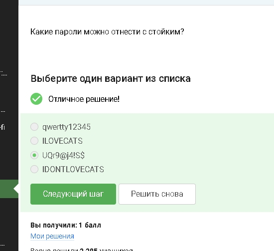
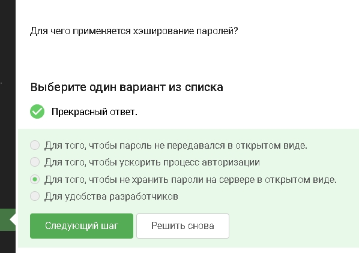
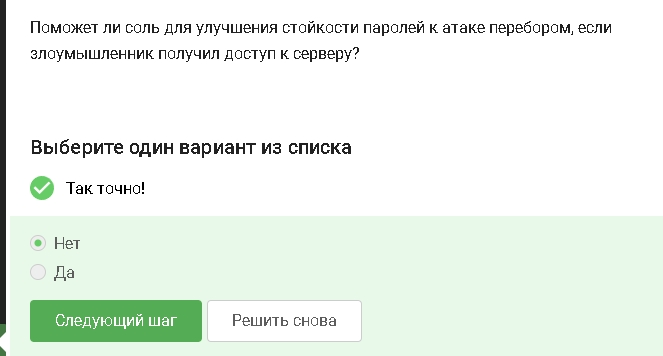
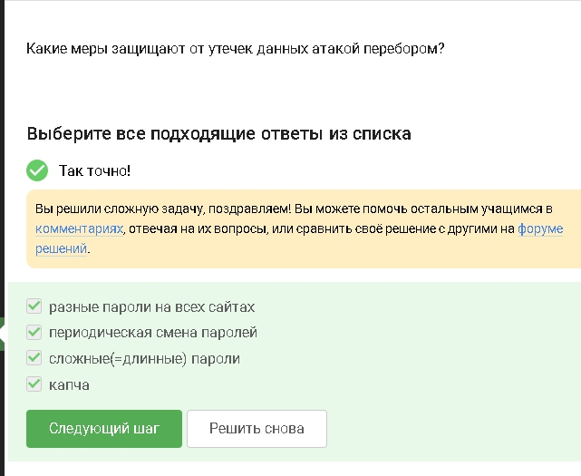
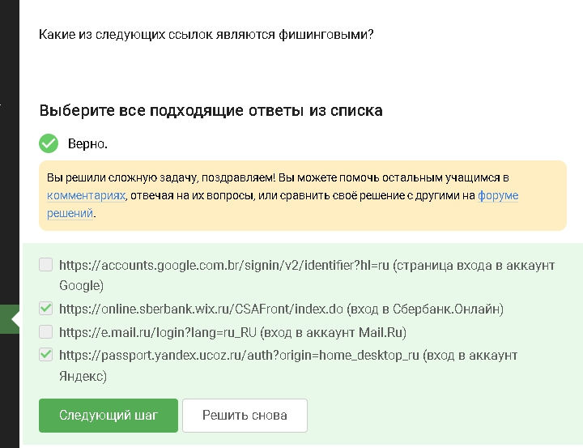

---
## Author
author:
  name: Абронина Алиса Кирилловна
  degrees: DSc
  orcid: 0000-0002-0877-7063
  email: 1132246717@rudn.ru
  affiliation:
    - name: Российский университет дружбы народов
      country: Российская Федерация
      postal-code: 117198
      city: Москва
      address: ул. Миклухо-Маклая, д. 6
## Title
title: Внешний курс 2 блок
subtitle: Защита ПК телефона
license: CC BY
date: today
date-format: "YYYY-MM-DD" # Example: 2025-09-06
---

# Информация

## Докладчик

:::::::::::::: {.columns align=center}
::: {.column width="70%"}

  * Абронина Алиса Кирилловна
  * НКАбд-01-24
  * Российский университет дружбы народов им. П. Лумумбы
  * [1132246717@rudn.ru](mailto:1132246717@rudn.ru)
  * <https://github.com/akabronina>

:::
::: {.column width="30%"}

:::
::::::::::::::

# Цель работы

Пройти второй блок курса

# Выполнение второго блока внешнего курса

Совеременные системы шифрования диска умеют шифровать даже загрузочную область 

---

Используется один и тот же ключ для шифрования и расшифровки - это бычтрее для больших объемов данных 

---

Wireshark анализирует трафик Disk Utility не является основной системой шифрования в этом констексте 

---

Длинный случайный с разными типами символов его сложно подобрать 

---

Они шифруют данные и помогают хранить слодные уникальные пароли 

---

CAPTCHA проверяет что пользователь человек а не бот 

---

На сервере хранится не пароль а его кэш 

---

Соль усложняет массовый перебор и использование готовых таблиц, но не делает пароль неуязвивым, если слабый 

---

Разные пароли - утечка одного не ломает остальные аккаунты. Периодическая смена - снижает время использования украденного пароля.
Слодные длинные пароли - тяжелее подобрать. Капча - мешает автоматическому перебору 

---

В себре настоящий домен не wix.ru в яндексе настоящий ucoz.ru 

---

Адрес отправителя можно подделать или аккаунт знакомого модет быть взломан 

---

Злоумышленник делает вид, что письмо от другого человека/компании 

---

Пользователь думает, что запускает полезное ПО 

---

Сигнал создает ключи и запускает механизм защищенного обмена при начале общения 

---

Сервер передает данные, но не может прочитать содержимое сообщенийй 

---

# Выводы

Прошла второй блок внешнего курса.

