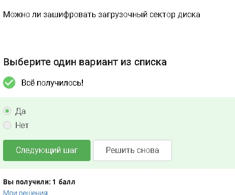
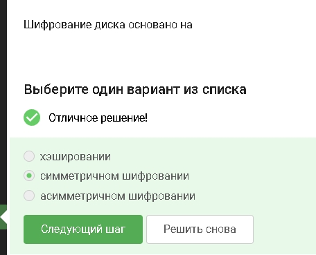
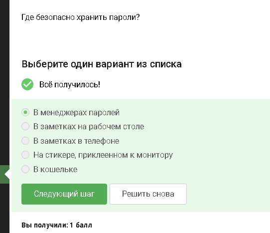
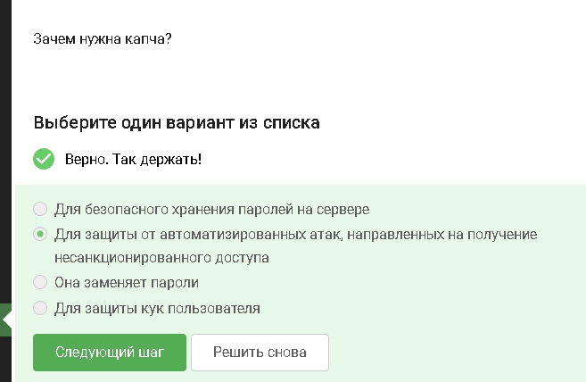
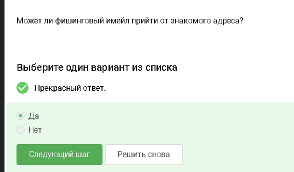
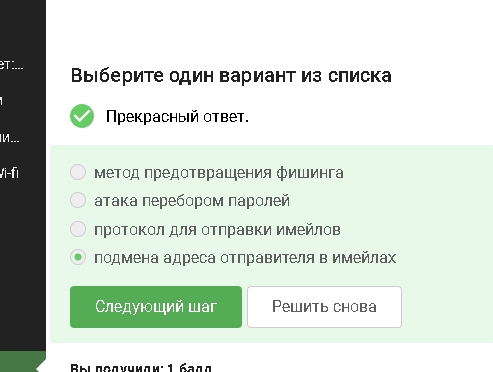
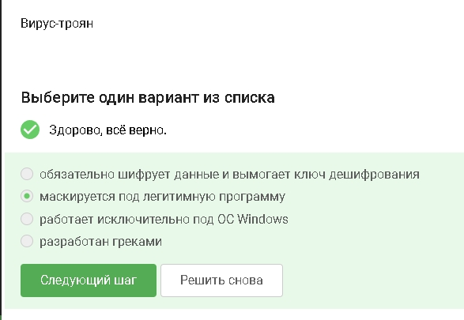
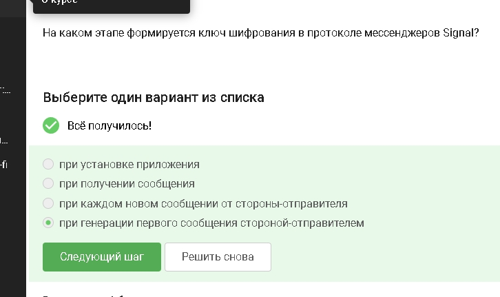
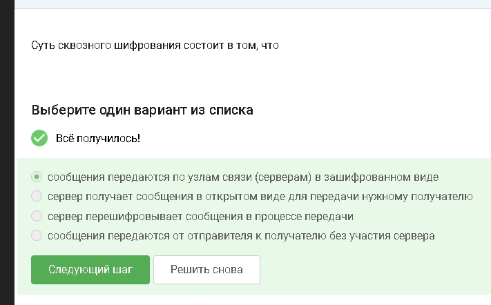

---
## Author
author:
  name: Абронина Алиса Кирилловна
  degrees: DSc
  orcid: 0000-0002-0877-7063
  email: 1132246717@rudn.ru
  affiliation:
    - name: Российский университет дружбы народов
      country: Российская Федерация
      postal-code: 117198
      city: Москва
      address: ул. Миклухо-Маклая, д. 6

## Title
title: "Внешний курс 2 блок"
subtitle: "Защита ПК телефона"
license: "CC BY"
---

# Цель работы

Пройти второй блок курса

# Выполнение второго блока внешнего курса

Совеременные системы шифрования диска умеют шифровать даже загрузочную область ([рис. @fig-001]).

{#fig-001 width=70%}

Используется один и тот же ключ для шифрования и расшифровки - это бычтрее для больших объемов данных ([рис. @fig-002]).

{#fig-002 width=70%}

Wireshark анализирует трафик Disk Utility не является основной системой шифрования в этом констексте ([рис. @fig-003]).

{#fig-003 width=70%}

Длинный случайный с разными типами символов его сложно подобрать ([рис. @fig-004]).

{#fig-004 width=70%}

Они шифруют данные и помогают хранить слодные уникальные пароли ([рис. @fig-005]).

{#fig-005 width=70%}

CAPTCHA проверяет что пользователь человек а не бот ([рис. @fig-006]).

{#fig-006 width=70%}

На сервере хранится не пароль а его кэш ([рис. @fig-007]).

{#fig-007 width=70%}

Соль усложняет массовый перебор и использование готовых таблиц, но не делает пароль неуязвивым, если слабый ([рис. @fig-008]).

{#fig-008 width=70%}

Разные пароли - утечка одного не ломает остальные аккаунты. Периодическая смена - снижает время использования украденного пароля.
Слодные длинные пароли - тяжелее подобрать. Капча - мешает автоматическому перебору ([рис. @fig-009]).

{#fig-009 width=70%}

В себре настоящий домен не wix.ru в яндексе настоящий ucoz.ru ([рис. @fig-010]).

{#fig-010 width=70%}

Адрес отправителя можно подделать или аккаунт знакомого модет быть взломан ([рис. @fig-011]).

{#fig-011 width=70%}

Злоумышленник делает вид, что письмо от другого человека/компании ([рис. @fig-012]).

{#fig-012 width=70%}

Пользователь думает, что запускает полезное ПО ([рис. @fig-013]).

{#fig-013 width=70%}

Сигнал создает ключи и запускает механизм защищенного обмена при начале общения ([рис. @fig-014]).

{#fig-014 width=70%}

Сервер передает данные, но не может прочитать содержимое сообщенийй ([рис. @fig-015]).

{#fig-015 width=70%}

# Выводы

Прошла второй блок внешнего курса.

