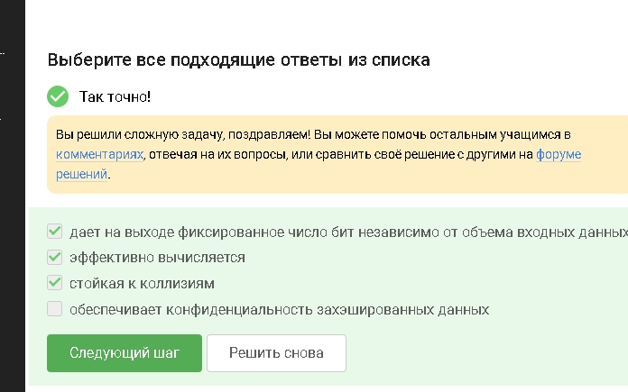
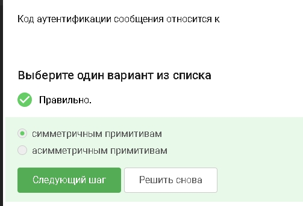
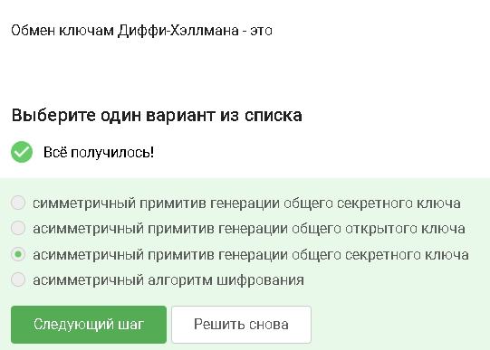
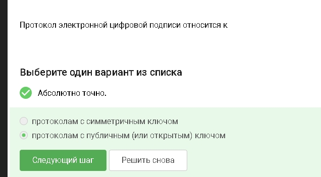
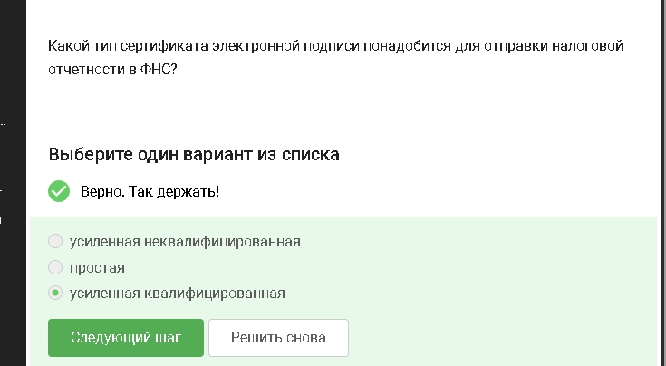
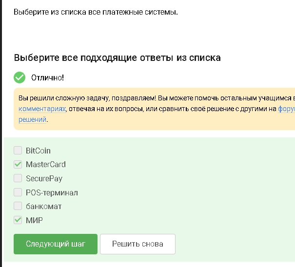
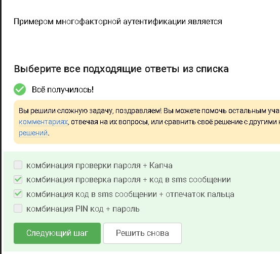
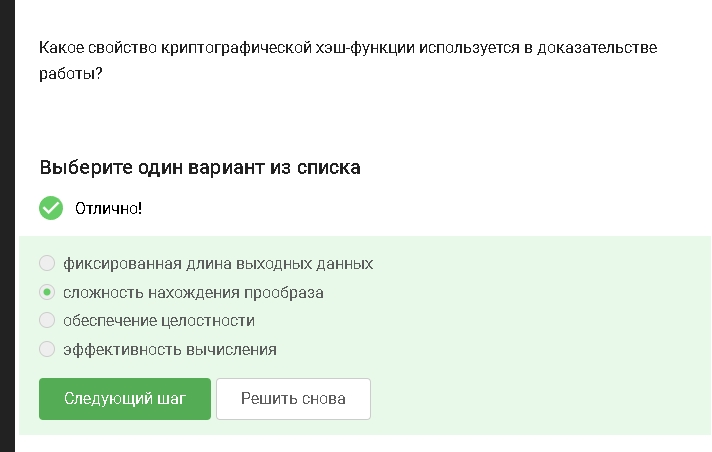
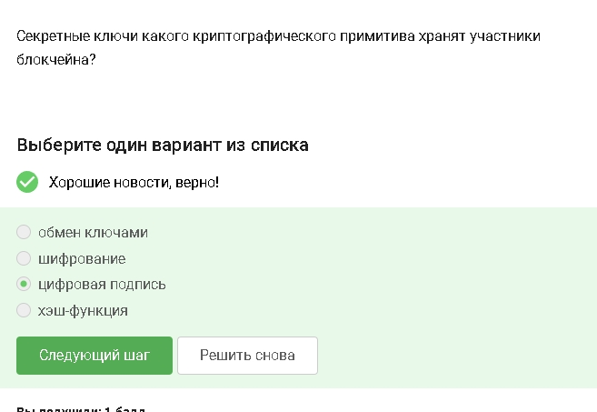

---
## Author
author:
  name: Абронина Алиса Кирилловна
  degrees: DSc
  orcid: 0000-0002-0877-7063
  email: 1132246717@rudn.ru
  affiliation:
    - name: Российский университет дружбы народов
      country: Российская Федерация
      postal-code: 117198
      city: Москва
      address: ул. Миклухо-Маклая, д. 6
## Title
title: Внешний курс 3 блок
subtitle: Криптография на практике
license: CC BY
date: today
date-format: "YYYY-MM-DD" # Example: 2025-09-06
---

# Информация

## Докладчик

:::::::::::::: {.columns align=center}
::: {.column width="70%"}

  * Абронина Алиса Кирилловна
  * НКАбд-01-24
  * Российский университет дружбы народов им. П. Лумумбы
  * [1132246717@rudn.ru](mailto:1132246717@rudn.ru)
  * <https://github.com/akabronina>

:::
::: {.column width="30%"}

:::
::::::::::::::

# Цель работы

Пройти третий блок курса

# Выполнение 3 блока внешнего курса 

У каждого есть открый и секретный ключ 

---

Не обспечивает конфенденциальность - хэш не шифрует данные 

---

AES-шифрование SHA2-хэш-фукнкция 

---

Обе стороны испольщуют общий секретный ключ 

---

Позволяет двум сторонам безопасно полчить общий секрет через открытый канал 

---

Подпись создается секретным ключом, проверяется открым 

---

Сообщение сверяют с подписью через открый ключ 

---

Подпись подтверждает автора и целостность, но не скрывает данные 

---

Она имеет юридическую силу в РФ 

---

Такие центры официально выдают сетрификаты ЭЦП 

---

Отсальное - устройства или другие технологии 

---

Остальные: один из них не фактор аунтефикации, второй - об аотносятся к знанию 

---

Например карта + смс 

---

Трудно подобрать вхрдные данные для нужного хэша 

---

Консенсус - узлы согласны с состоянием сети. Живучесть - система продолжает работать. ОТкрытость - участие доступно многим. Постоянство - данные сложно изменить задним числом 

---

Ими подпиывают транзакции, подтверждая владение средствами 

---

# Выводы

Прошла третий блок. 

