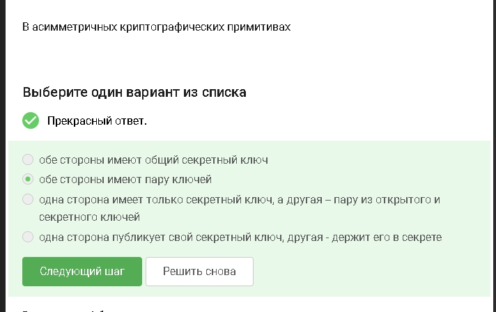
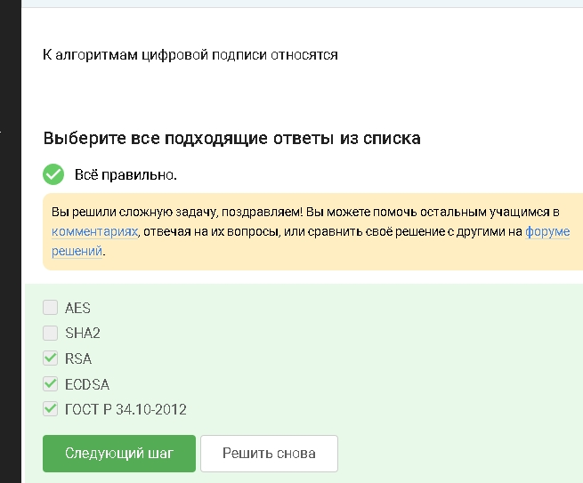
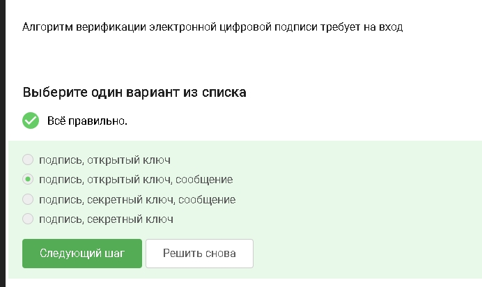
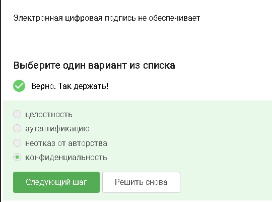
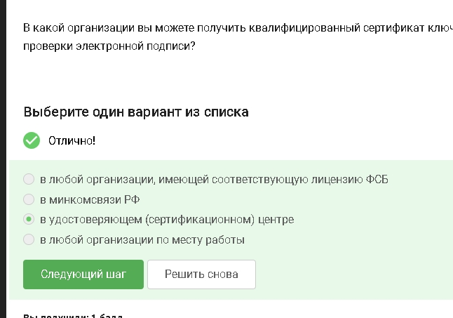
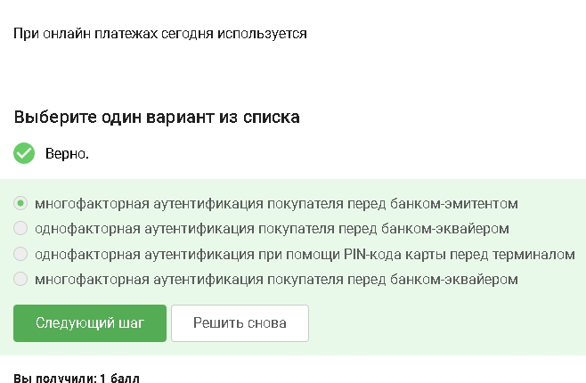
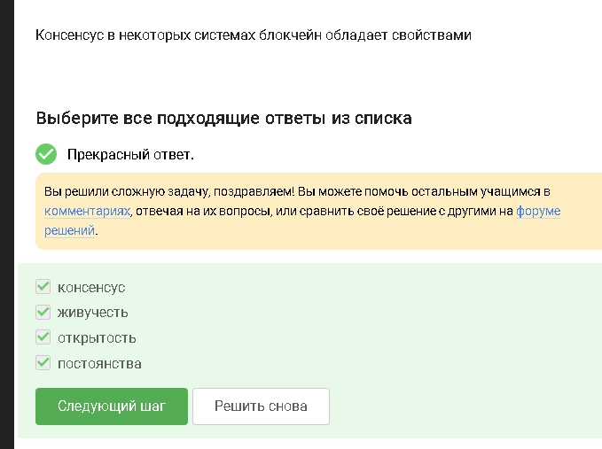

---
## Author
author:
  name: Абронина Алиса Кирилловна
  degrees: DSc
  orcid: 0000-0002-0877-7063
  email: 1132246717@rudn.ru
  affiliation:
    - name: Российский университет дружбы народов
      country: Российская Федерация
      postal-code: 117198
      city: Москва
      address: ул. Миклухо-Маклая, д. 6

## Title
title: "Внешний курс 3 блок"
subtitle: "Криптография на практике"
license: "CC BY"
---

# Цель работы

Пройти третий блок курса

# Выполнение 3 блока внешнего курса 

У каждого есть открый и секретный ключ ([рис. @fig-001]).

{#fig-001 width=70%}

Не обспечивает конфенденциальность - хэш не шифрует данные ([рис. @fig-002]).

{#fig-002 width=70%}

AES-шифрование SHA2-хэш-фукнкция ([рис. @fig-003]).

{#fig-003 width=70%}

Обе стороны испольщуют общий секретный ключ ([рис. @fig-004]).

{#fig-004 width=70%}

Позволяет двум сторонам безопасно полчить общий секрет через открытый канал ([рис. @fig-005]).

{#fig-005 width=70%}

Подпись создается секретным ключом, проверяется открым ([рис. @fig-006]).

{#fig-006 width=70%}

Сообщение сверяют с подписью через открый ключ ([рис. @fig-007]).

{#fig-007 width=70%}

Подпись подтверждает автора и целостность, но не скрывает данные ([рис. @fig-008]).

{#fig-008 width=70%}

Она имеет юридическую силу в РФ ([рис. @fig-009]).

{#fig-009 width=70%}

Такие центры официально выдают сетрификаты ЭЦП ([рис. @fig-010]).

{#fig-010 width=70%}

Отсальное - устройства или другие технологии ([рис. @fig-011]).

{#fig-011 width=70%}

Остальные: один из них не фактор аунтефикации, второй - об аотносятся к знанию ([рис. @fig-012]).

{#fig-012 width=70%}

Например карта + смс ([рис. @fig-013]).

{#fig-013 width=70%}

Трудно подобрать вхрдные данные для нужного хэша ([рис. @fig-014]).

{#fig-014 width=70%}

Консенсус - узлы согласны с состоянием сети. Живучесть - система продолжает работать. ОТкрытость - участие доступно многим. Постоянство - данные сложно изменить задним числом ([рис. @fig-015]).

{#fig-015 width=70%}

Ими подпиывают транзакции, подтверждая владение средствами ([рис. @fig-016]).

{#fig-016 width=70%}

# Выводы

Прошла третий блок. 

