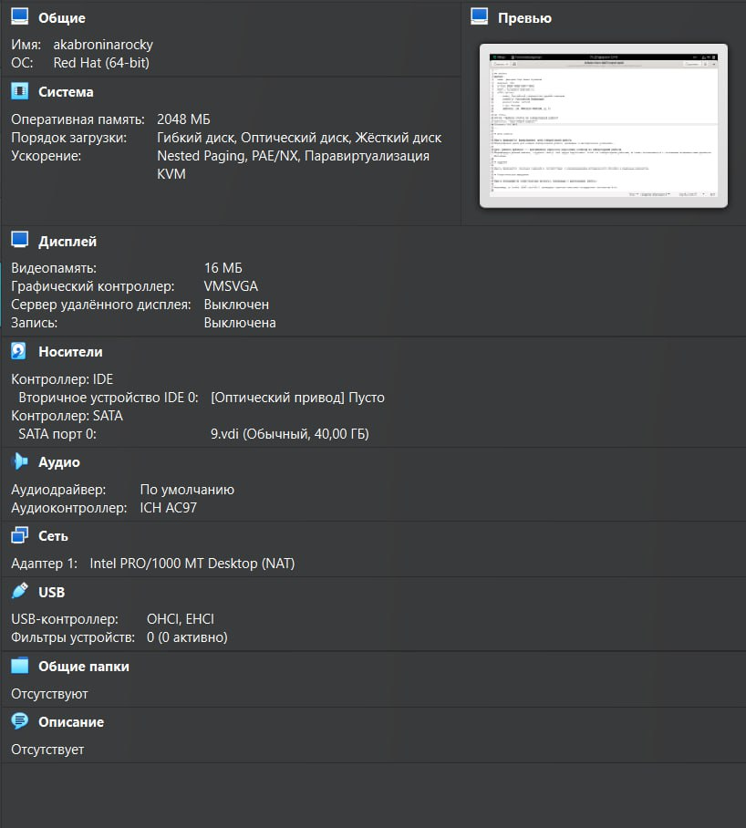
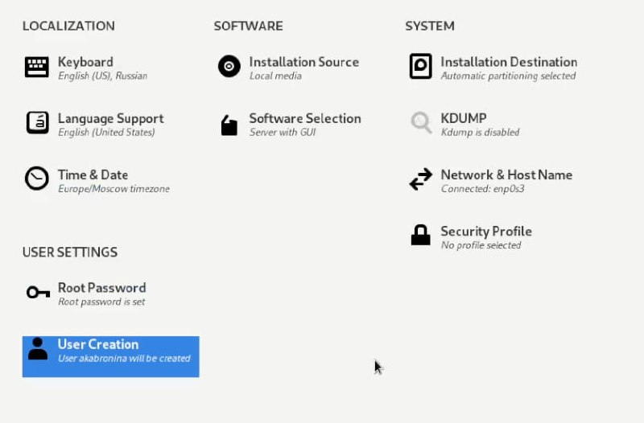
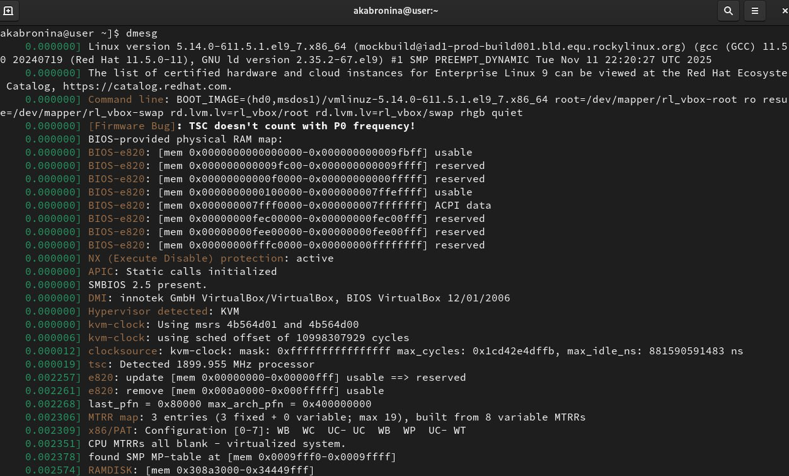

---
## Author
author:
  name: Абронина Алиса КИрилловна
  degrees: DSc
  orcid: 0000-0002-0877-7063
  email: 1132246717@rudn.ru
  affiliation:
    - name: Российский университет дружбы народов
      country: Российская Федерация
      postal-code: 117198
      city: Москва
      address: ул. Миклухо-Маклая, д. 6
## Title
title: Лабораторная работа № 1
license: CC BY
date: today
date-format: "YYYY-MM-DD" # Example: 2025-09-06
---

## Докладчик

:::::::::::::: {.columns align=center}
::: {.column width="70%"}

  * Абронина Алиса Кирилловна
  * студент ФФМИЕН НКАбд-01-24
  * Российский университет дружбы народов им. П. Лумумбы
  * 1132246717@rudn.ru

:::
::: {.column width="30%"}

:::
::::::::::::::

# Лабораторная работа № 1

## Цель работы

Целью данной лабораторной работы является приобретение практических навыков установки операционной системы на виртуальную машину, настройки минимально необходимых для дальнейшей работы сервисов.

## Задание

1. Установка Rocky
2. Работа с терминалом
3. Контрольные ыопросы

## Выполнение лабораторной работы

## Установка Rocky

---

Далее устанавливаем имя пользователся, название хоста, языки, страну и др

## Работа с терминалом 

Команда dmesg 

Далее с помощью команды dmesg ищем: версия ядра, частота процессора, модель процессора, объем доступной оперативной памяти, тип обнаруженного гипервизора, тип файловой системы корневого раздела. 

---

---

## Выводы

Приобрела практические навыки установки операционной системы на виртуальную машину, настройки минимально необходимых для дальнейшей работы сервисов.

