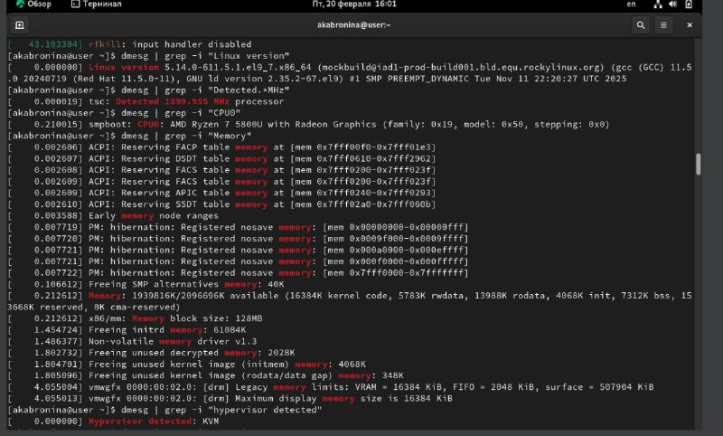
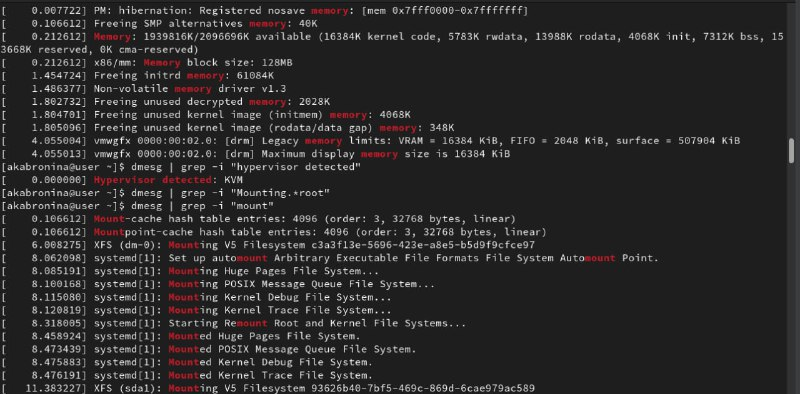

---
## Author
author:
  name: Абронина Алиса Кирилловна
  degrees: DSc
  orcid: 0000-0002-0877-7063
  email: 1132246717@rudn.ru
  affiliation:
    - name: Российский университет дружбы народов
      country: Российская Федерация
      postal-code: 117198
      city: Москва
      address: ул. Миклухо-Маклая, д. 6

## Title
title: "Лаброраторная работа № 1"
subtitle: "Установка и конфигурация операционной системы на виртуальную машину"
license: "CC BY"
---

# Цель работы

Целью данной лабораторной работы является приобретение практических навыков установки операционной системы на виртуальную машину, настройки минимально необходимых для дальнейшей работы сервисов.

# Задание

1. Установка Rocky
2. Работа с терминалом
3. Контрольные ыопросы

# Выполнение лабораторной работы

## Установка Rocky

(см. рис. @fig-001)

{#fig-001 width=70%}

Далее устанавливаем имя пользователся, название хоста, языки, страну и др(см. рис. @fig-002)

{#fig-002 width=70%}

## Работа с терминалом 

Команда dmesg  (см. рис. @fig-003)

{#fig-003 width=70%}

Далее с помощью команды dmesg ищем: версия ядра, частота процессора, модель процессора, объем доступной оперативной памяти, тип обнаруженного гипервизора, тип файловой системы корневого раздела. (см. рис. @fig-004)(см. рис. @fig-005)

{#fig-004 width=70%}

{#fig-005 width=70%}

## Контрольные вопросы 

1) Какую информацию содержит учетная запись пользователя?

Имя пользователя, зашифрованный пароль пользователя, индентификационный номер пользователя, индентификационный номер группы пользователя, домашний каталог пользователя, командный интерпретатор пользователя.

2) Укажите команды терминала и приведите примеры: 
-для получения справки по команде: man <назввание команды> man cd
-ддя перемещения по файловой системе: cd cd ~/Downloads
-для просмотра содержимого каталога: ls ls ~/Downloads
-для определения объема каталога: du <имя каталога> du Downloads
-для создания каталогов: mkdir <имя каталога> mkdir ~/Downloads/New
-для создания файлов: touch <имя файла> touch retouch
-для удаления каталогов: rm <имя каталога> rm dir1
-для удаления файлов: rm -r <имя файла> rm -r text.txt
-для задания определенных прав на файл или каталог: chmod + x <имя каталога или файла> chmod +x text.txt
-для просмотра истории команд: history

3) Что такое файловая система? Приведите примеры с краткой характеристикой.

Файловая система - это часть операционной системы, назначение которой состоит в том, чтобы обеспечить пользователю удобный интерфейс при работе с данными, хранящимися на диске, и обеспечить совместное использование файлов несколькими пользователями и процессорами.
Примеры файловых систем: 
Ext2, Ext3, Ext4 или Extended Felisystem - стандартная файловая система для Linux.
NTFS (New Technology File System):  Стандартная файловая система для Windows.

4) Как посмотреть, какие файловые системы подмонтированы в ОС?

С помощью команды mount

5) Как удалить зависший процесс?

С помощью команды kill.

# Выводы

Приобрела практические навыки установки операционной системы на виртуальную машину, настройки минимально необходимых для дальнейшей работы сервисов.

# Список литературы{.unnumbered}

::: {#refs}
:::
