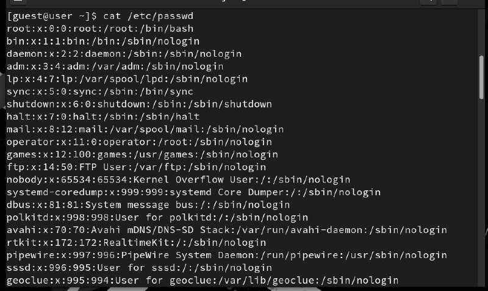
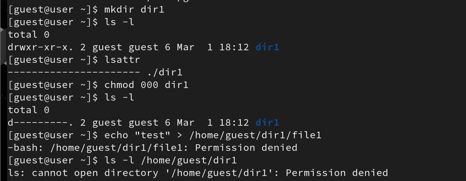

---
## Author
author:
  name: Абронина Алиса Кирилловна
  degrees: DSc
  orcid: 0000-0002-0877-7063
  email: 1132246717@rudn.ru
  affiliation:
    - name: Российский университет дружбы народов
      country: Российская Федерация
      postal-code: 117198
      city: Москва
      address: ул. Миклухо-Маклая, д. 6
## Title
title: Лабораторная работа № 2
subtitle: Дискреционное разграничение прав в Linux. Основные атрибуты
license: CC BY
date: today
date-format: "YYYY-MM-DD" # Example: 2025-09-06
---

# Информация

## Докладчик

:::::::::::::: {.columns align=center}
::: {.column width="70%"}

  * Абронина Алиса Кирилловна
  * стдуент НКАбд-01-24
  * Российский университет дружбы народов им. П. Лумумбы
  * [1132246717@rudn.ru]

:::
::: {.column width="30%"}

:::
::::::::::::::

# Цель работы

Получение практических навыков работы в консоли с атрибутами файлов,закрепление теоретических основ дискреционного разграничения доступа в современных системах с открытым кодом на базе ОС Linux1.

# Выполнение лабораторной работы

В установленной при выполнении предыдущей лабораторной работы операционной системе создаю учётную запись пользователя guest. Задаю пароль. 

---

Вхожу в систему от имени пользователя guest. Определяю директорию, в которой вы находитесь, командой pwd. 

---

Уточняю имя пользователя командой whoami. Уточняю имя пользователя, группу, а также группы, куда входит пользователь, командой id. 

---

Просматриваю файл /etc/passwd командой cat /etc/passwd

---

---

Определяю существующие в системе директории командой ls -l /home/ Проверяю, какие расширенные атрибуты установлены на поддиректориях, находящихся в директории /home, командой: lsattr /home 

---

---

Создаю в домашней директории поддиректорию dir1 командой mkdir dir1 Определяю командами ls -l и lsattr, какие права доступа и расширенные атрибуты были выставлены на директорию dir1.Снимаю с директории dir1 все атрибуты командой chmod 000 dir1 и проверяю с её помощью правильность выполнения команды ls -l Пытаюсь создать в директории dir1 файл file1 командой echo "test" > /home/guest/dir1/file1 Проверяю командой ls -l /home/guest/dir1 действительно ли файл file1 не находится внутри директории dir1.

---

---

Заполняю таблицы по заданию

| Права директории | Права файла | Создание файла | Удаление файла | Запись в файл | Чтение файла | Смена директории | Просмотр файлов | Переименование | Смена атрибутов |
|------------------|------------|----------------|----------------|---------------|--------------|------------------|------------------|----------------|-----------------|
| d(777)           | (777)      | +              | +              | +             | +            | +                | +                | +              | +               |
| d(300)           | (300)      | +              | +              | +             | -            | +                | -                | +              | +               |

---

| Операция                     | Минимальные права на директорию | Минимальные права на файл |
|-------------------------------|---------------------------------|---------------------------|
| Создание файла               | wx                              | —                         |
| Удаление файла               | wx                              | —                         |
| Чтение файла                 | x                               | r                         |
| Запись в файл                | x                               | w                         |
| Переименование файла         | wx                              | —                         |
| Создание поддиректории       | wx                              | —                         |
| Удаление поддиректории       | wx                              | —                         |

# Выводы

Получила практические навыки работы в консоли с атрибутами файлов,закрепила теоретические основы дискреционного разграничения доступа в современных системах с открытым кодом на базе ОС Linux1.

