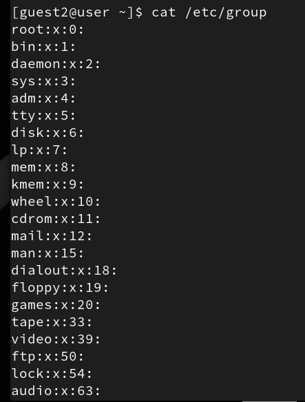
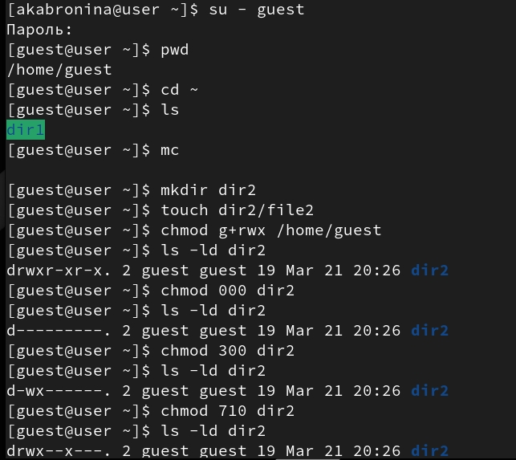

---
## Author
author:
  name: Абронина Алиса Кирилловна
  degrees: DSc
  orcid: 0000-0002-0877-7063
  email: kulyabov-ds@rudn.ru
  affiliation:
    - name: Российский университет дружбы народов
      country: Российская Федерация
      postal-code: 117198
      city: Москва
      address: ул. Миклухо-Маклая, д. 6
## Title
title: Лабораторная работа № 3.
subtitle: Дискреционное разграничение прав в Linux. Два пользователя
license: CC BY
date: today
date-format: "YYYY-MM-DD" # Example: 2025-09-06
---

# Информация

## Докладчик

:::::::::::::: {.columns align=center}
::: {.column width="70%"}

  * Абронина Алиса Кирилловна
  * НКАбд-01-24
  * Российский университет дружбы народов им. П. Лумумбы
  * [1132246717@rudn.ru](mailto:1132246717@rudn.ru)
  * <https://github.com/akabronina>

:::
::: {.column width="30%"}

:::
::::::::::::::

# Цель работы

Получение практических навыков работы в консоли с атрибутами файлов для групп пользователей

# Выполнение лабораторной работы

В установленной операционной системе создаю учётную запись пользователя guest Задаю пароль для пользователя gues Аналогично создаю второго пользователя guest2. Добавляю пользователя guest2 в группу guest 

---

Осуществите вход в систему от двух пользователей на двух разных консолях: guest на первой консоли и guest2 на второй консоли.Для обоих пользователей командой pwd определите директорию, в которой вы находитесь 
Уточните имя вашего пользователя, его группу, кто входит в неё
и к каким группам принадлежит он сам. Определите командами
groups guest и groups guest2, в какие группы входят пользовате-
ли guest и guest2. Сравните вывод команды groups с выводом команд
id -Gn и id -G  

---

---

Сравните полученную информацию с содержимым файла /etc/group.
Просмотрите файл командой
cat /etc/group  

---

---

 От имени пользователя guest2 выполните регистрацию пользователя
guest2 в группе guest командой
newgrp guest От имени пользователя guest измените права директории /home/guest, разрешив все действия для пользователей группы: chmod g+rwx /home/guest От имени пользователя guest снимите с директории /home/guest/dir1
все атрибуты командой Меняя атрибуты у директории dir1 и файла file1 от имени пользователя guest и делая проверку от пользователя guest2, заполните табл. 3.1, определив опытным путём, какие операции разрешены, а какие нет. Если операция разрешена, занесите в таблицу знак «+», если не разрешена,
знак «-»

---

---

---

| Права директории | Права файла | Создание файла | Удаление файла | Запись в файл | Чтение файла | Смена директории | Просмотр файлов | Переименование | Смена атрибутов |
|------------------|------------|----------------|----------------|---------------|--------------|------------------|------------------|----------------|-----------------|
| d(000)           | (000)      | -              | -              | -             | -            | -                | -                | -              | -               |
| d(010)           | (000)      | -              | -              | -             | -            | +                | -                | -              | -               |
| d(070)           | (070)      | +              | +              | +             | +            | +                | +                | +              | +               |

---

| Операция                     | Минимальные права на директорию | Минимальные права на файл |
|-----------------------------|---------------------------------|---------------------------|
| Создание файла              | wx                              | —                         |
| Удаление файла              | wx                              | —                         |
| Чтение файла                | x                               | r                         |
| Запись в файл               | x                               | w                         |
| Переименование файла        | wx                              | —                         |
| Создание поддиректории      | wx                              | —                         |
| Удаление поддиректории      | wx                              | —                         |

# Выводы

Получила практические навыки работы в консоли с атрибутами файлов для групп пользователей

