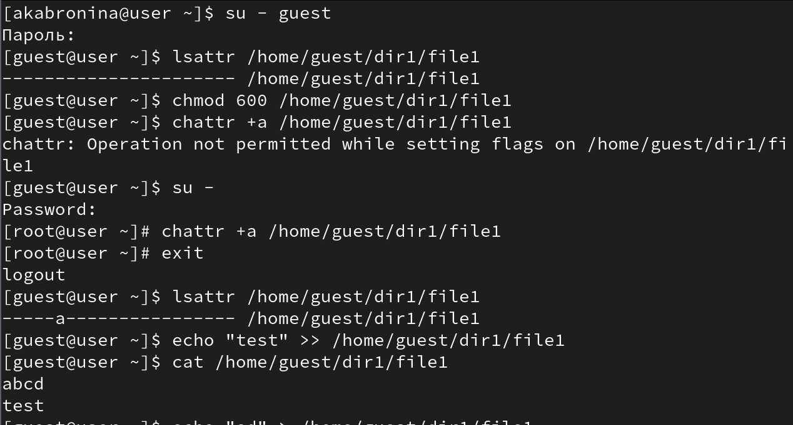
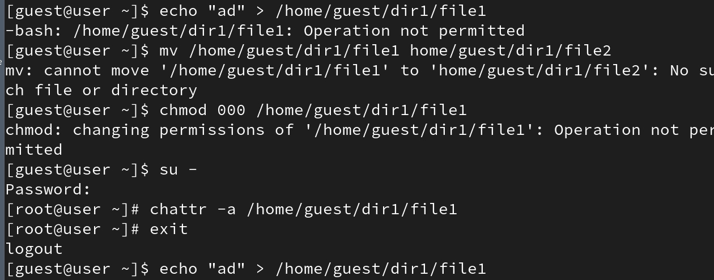
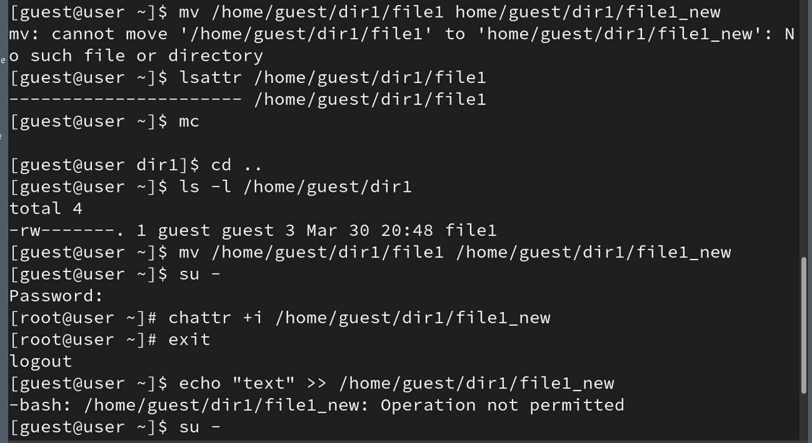
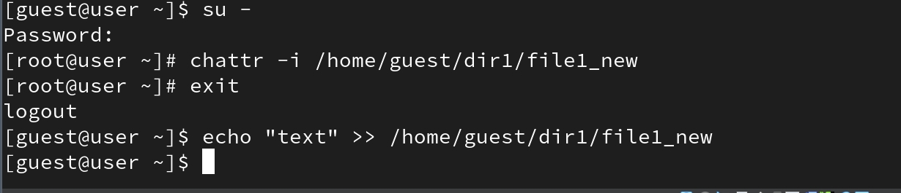

---
## Author
author:
  name: Абронина Алиса Кирилловна
  degrees: DSc
  orcid: 0000-0002-0877-7063
  email: 1132246717@rudn.ru
  affiliation:
    - name: Российский университет дружбы народов
      country: Российская Федерация
      postal-code: 117198
      city: Москва
      address: ул. Миклухо-Маклая, д. 6
## Title
title: Лабораторная работа № 4
subtitle: Работа с расширенными атрибутами файлов в Linux
license: CC BY
date: today
date-format: "YYYY-MM-DD" # Example: 2025-09-06
---

# Информация

## Докладчик

:::::::::::::: {.columns align=center}
::: {.column width="70%"}

  * Абронина Алиса Кирилловна
  * НКАбд-01-24
  * Российский университет дружбы народов им. П. Лумумбы
  * [1132246717@rudn.ru](mailto:1132246717@rudn.ru)
  * <https://github.com/akabronina>

:::
::: {.column width="30%"}

:::
::::::::::::::

# Цель работы

Научиться работать с расширенными атрибутами файлов, освоить дозапись, запрет записи и удаление файлов в Linux через команную строку

# Выполнение лабораторной работы

Вхожу в систему в пользователь guest. Выполняю команду, которая показывает атрибуты файла. Устанавливаю права доступа для владельца. Попытка установить атрибут "а". Так как атрибус а может устанавливать тлоько суперпользователь, перехожу на него. Устанавливаю атрибут, который разрешает только добавлять данные, нельзя удалять или перезаписывать существующее содержимое. Возвращаюсь к пользователю guest Смотрю установлен ли атрибут. Пытаюсь добавить текст. Проверяю содержимое 

---

---

Пробую стереть содержимое, переименовать файл. Неудачно. Пробую запретить все права владельцу, снова не получается из-за атрибута а. Перехожу на суперпользователя и убираю данный атрибут. Перехожу обратно в пользователя. Перезаписываю файл, переименовываю. Работает. Перехожу на суперпользователя и устанавляю атрибут i Обратно на пользователя, пробую дозаписать файл. Не удается из-за атрибута i.

---

---

---

Снимаю атрибут i. После снятия все выпаолняется успешно

# Выводы

Научилась работать с расширенными атрибутами файлов, освоила дозапись, запрет записи и удаление файлов в Linux через команную строку

