---
## Author
author:
  name: Абронина Алиса Кирилловна
  degrees: DSc
  orcid: 0000-0002-0877-7063
  email: kulyabov-ds@rudn.ru
  affiliation:
    - name: Российский университет дружбы народов
      country: Российская Федерация
      postal-code: 117198
      city: Москва
      address: ул. Миклухо-Маклая, д. 6
## Title
title: Лабораторная работа № 5
subtitle: Дискреционное разграничение прав в Linux. Исследование влияния дополнительных атрибутов
license: CC BY
date: today
date-format: "YYYY-MM-DD" # Example: 2025-09-06
---

# Информация

## Докладчик

:::::::::::::: {.columns align=center}
::: {.column width="70%"}

  * Абронина Алиса Кирилловна
  * НКАбд-01-24
  * Российский университет дружбы народов им. П. Лумумбы
  * [1132446717@rudn.ru](mailto:1132246717@rudn.ru)
  * <https://github.com/akabronina>

:::
::: {.column width="30%"}

:::
::::::::::::::

# Цель работы

Изучение механизмов изменения идентификаторов, применения SetUID- и Sticky-битов. Получение практических навыков работы в консоли с дополнительными атрибутами. Рассмотрение работы механизма смены идентификатора процессов пользователей, а также влияние бита Sticky на запись и удаление файлов.

# Выполнение лабораторной работы

 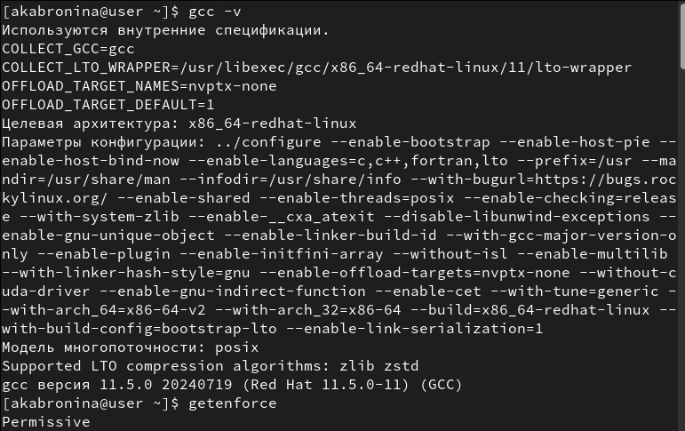

---

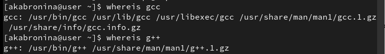

---

Вхожу в систему от имени пользователя guest. Создаю программу simpleid.c комплирую программу и убеждаюсь, что файл программы создан Выаолняю программу simpleid Выполняю системную программу id

---

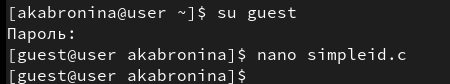

---

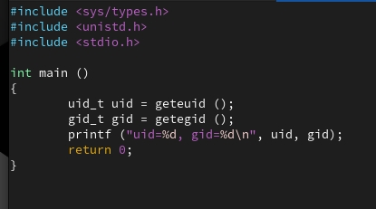

---

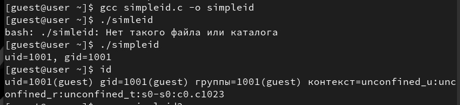

---

Усложняю программу, добавив вывод действительных идентификато-
ров Получившуюся программу называю simpleid2.c. Комплирую и запускаю simpleid2.c

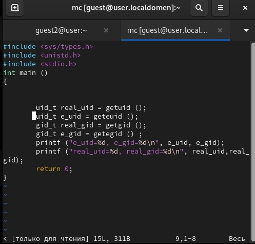

---

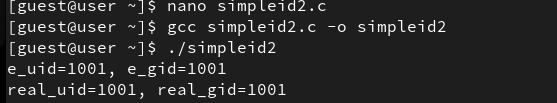

---

От имени суперпользователя выполняю команды:
chown root:guest /home/guest/simpleid2
chmod u+s /home/guest/simpleid2
Использую sudo 
Выаполняю проверку правильности установки новых атрибутов и смены
владельца файла simpleid2:
ls -l simpleid2
Запускаю simpleid2 и id:
./simpleid2
id

---

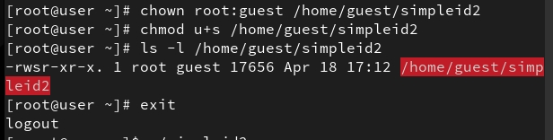

---

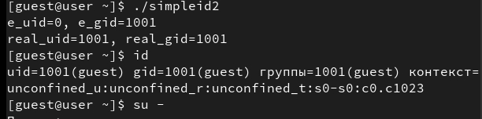

---

Создаю программу readfile.c ОТкопилирую её.
gcc readfile.c -o readfile
Меняю владельца у файла readfile.c 
Проверяю, что пользователь guest не может прочитать файл readfile.c.

---

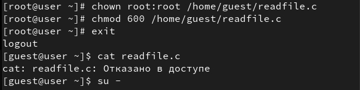

Выясняю, установлен ли атрибут Sticky на директории /tmp, для чего
выполняю команду
ls -l / | grep tmp  От имени пользователя guest создаю файл file01.txt в директории /tmp
со словом test:
echo "test" > /tmp/file01.txt
Просматриваю атрибуты у только что созданного файла и разрешаю чте-
ние и запись для категории пользователей «все остальные»:
ls -l /tmp/file01.txt
chmod o+rw /tmp/file01.txt
ls -l /tmp/file01.txt
 От пользователя guest2 пробую про-
читать файл /tmp/file01.txt:
cat /tmp/file01.txt  От пользователя guest2 пробую дозаписать в файл
/tmp/file01.txt слово test2 командой
echo "test2" > /tmp/file01.txt
Проверяю содержимое файла командой
cat /tmp/file01.txt
От пользователя guest2 пробую удалить файл /tmp/file01.txt ко-
мандой
rm /tmp/fileOl.txt
Повышаю свои права до суперпользователя следующей командой
su -
и выполняю после этого команду, снимающую атрибут t (Sticky-бит) с
директории /tmp:
chmod -t /tmp
Покидаю режим суперпользователя командой
exit
От пользователя guest2 проверяю, что атрибута t у директории /tmp
нет:
ls -l / | grep tmp
Повторяю  предыдущие шаги. 
Повышаю свои права до суперпользователя и верните атрибут t на ди-
ректорию /tmp:
su -
chmod +t /tmp
exit 

---

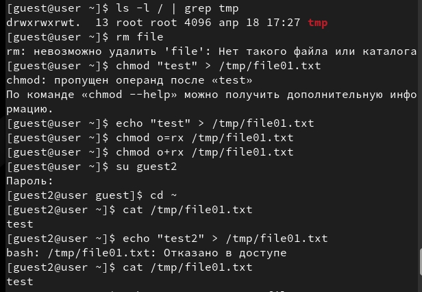

---

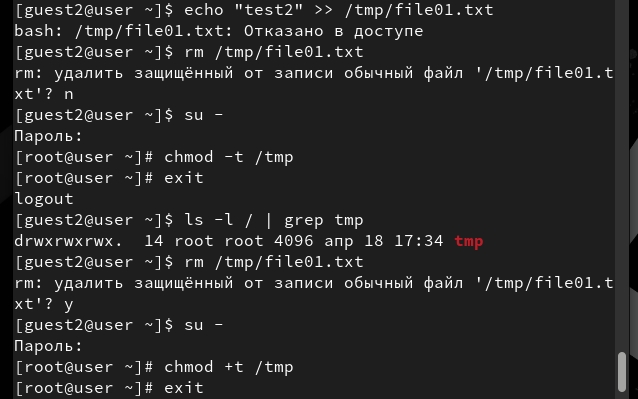

# Выводы

Изучила механизмы изменения идентификаторов, применения SetUID- и Sticky-битов. Получила практические навыки работы в консоли с дополнительными атрибутами. Рассмотрела работу механизма смены идентификатора процессов пользователей, а также влияние бита Sticky на запись и удаление файлов.

