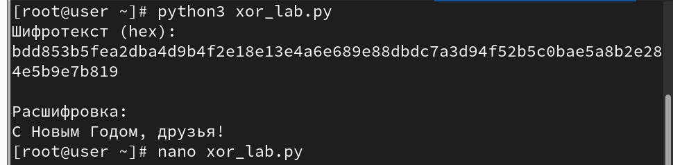
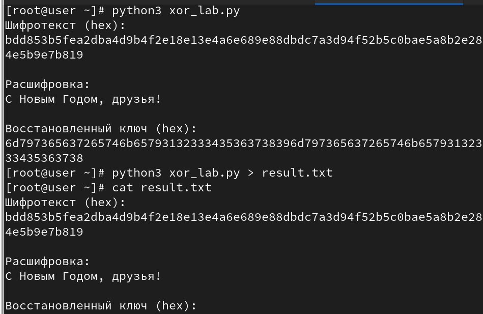

---
## Author
author:
  name: Абронина Алиса Кирилловна
  degrees: DSc
  orcid: 0000-0002-0877-7063
  email: 1132246717@rudn.ru
  affiliation:
    - name: Российский университет дружбы народов
      country: Российская Федерация
      postal-code: 117198
      city: Москва
      address: ул. Миклухо-Маклая, д. 6
## Title
title: Лабораторная работа № 7
subtitle: Элементы криптографии. Однократное гаммирование
license: CC BY
date: today
date-format: "YYYY-MM-DD" # Example: 2025-09-06
---

# Информация

## Докладчик

:::::::::::::: {.columns align=center}
::: {.column width="70%"}

  * Абронина Алиса Кирилловна
  * НКАбд-01-24
  * Российский университет дружбы народов им. П. Лумумбы
  * [1132246717@rudn.ru](mailto:1132246717@rudn.ru)
  * <https://github.com/akabronina>

:::
::: {.column width="30%"}

:::
::::::::::::::

# Цель работы

Освоить на практике применение режима однократного гаммирования

# Выполнение лабораторной работы

Подобрала  ключ, чтобы получить сообщение «С Новым Годом,
друзья!».Разработала приложение, позволяющее шифровать и
дешифровать данные в режиме однократного гаммирования. Приложение
должно:
1. Определить вид шифротекста при известном ключе и известном откры-
том тексте.
2. Определить ключ, с помощью которого шифротекст может быть преоб-
разован в некоторый фрагмент текста, представляющий собой один из
возможных вариантов прочтения открытого текста

---

---

---

---

# Выводы

Освоила на практике применение режима однократного гаммирования

