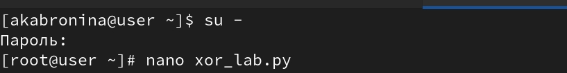
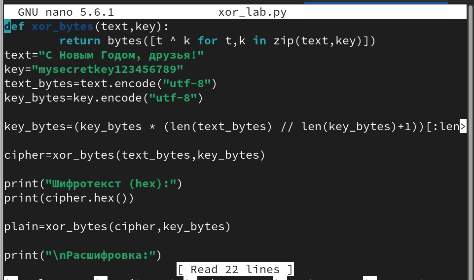

---
## Author
author:
  name: Абронина Алиса Кирилловна
  degrees: DSc
  orcid: 0000-0002-0877-7063
  email: 1132246717@rudn.ru
  affiliation:
    - name: Российский университет дружбы народов
      country: Российская Федерация
      postal-code: 117198
      city: Москва
      address: ул. Миклухо-Маклая, д. 6

## Title
title: "Лабораторная работа № 7."
subtitle: "Элементы
криптографии. Однократное гаммирование"
license: "CC BY"
---

# Цель работы

Освоить на практике применение режима однократного гаммирования

# Выполнение лабораторной работы

Подобрала  ключ, чтобы получить сообщение «С Новым Годом,
друзья!».Разработала приложение, позволяющее шифровать и
дешифровать данные в режиме однократного гаммирования. Приложение
должно:
1. Определить вид шифротекста при известном ключе и известном откры-
том тексте.
2. Определить ключ, с помощью которого шифротекст может быть преоб-
разован в некоторый фрагмент текста, представляющий собой один из
возможных вариантов прочтения открытого текста([рис. @fig-001]).([рис. @fig-002]).([рис. @fig-003]).([рис. @fig-004]).([рис. @fig-005]).

{#fig-001 width=70%}

{#fig-002 width=70%}

{#fig-003 width=70%}

{#fig-004 width=70%}

{#fig-005 width=70%}

# Выводы

Освоила на практике применение режима однократного гаммирования

