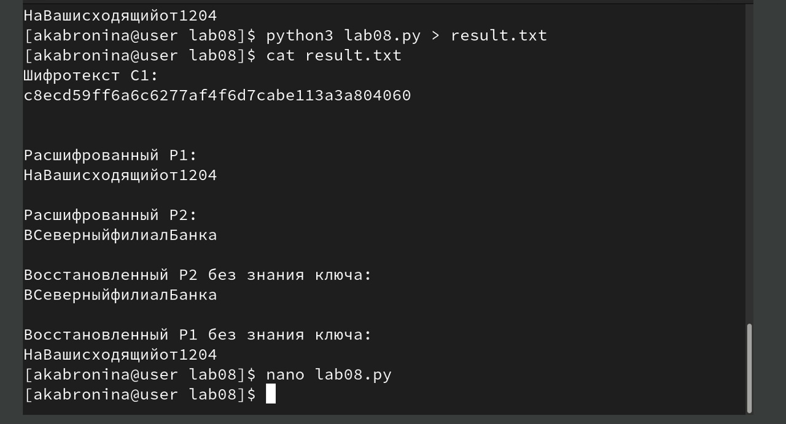

---
## Author
author:
  name: Абронина Алиса Кирилловна
  degrees: DSc
  orcid: 0000-0002-0877-7063
  email: 1132246717@rudn.ru
  affiliation:
    - name: Российский университет дружбы народов
      country: Российская Федерация
      postal-code: 117198
      city: Москва
      address: ул. Миклухо-Маклая, д. 6
## Title
title: Лабораторная работа № 8
subtitle: Элементы криптографии. Шифрование (кодирование) различных исходных текстов одним ключом
license: CC BY
date: today
date-format: "YYYY-MM-DD" # Example: 2025-09-06
---

# Информация

## Докладчик

:::::::::::::: {.columns align=center}
::: {.column width="70%"}

  * Абронина Алиса Кирилловна
  * НКАбд-01-24
  * Российский университет дружбы народов им. П. Лумумбы
  * [1132246717@rudn.ru](mailto:1132246717@rudn.ru)
  * <https://github.com/akabronina>

:::
::: {.column width="30%"}

:::
::::::::::::::

# Цель работы

Освоить на практике применение режима однократного гаммирования
на примере кодирования различных исходных текстов одним ключом1.

# Выполнение лабораторной работы

Нужно разоботать приложение, позволяющее шифровать и дешифровать тексты P1 и P2 в режиме однократного гаммирования. Прило-
жение должно определить вид шифротекстов C1 и C2 обоих текстов P1 и
P2 при известном ключе ; Необходимо определить и выразить аналитиче-
ски способ, при котором злоумышленник может прочитать оба текста, не
зная ключа и не стремясь его определить  

---

---

---

# Выводы

Освоила на практике применение режима однократного гаммирования
