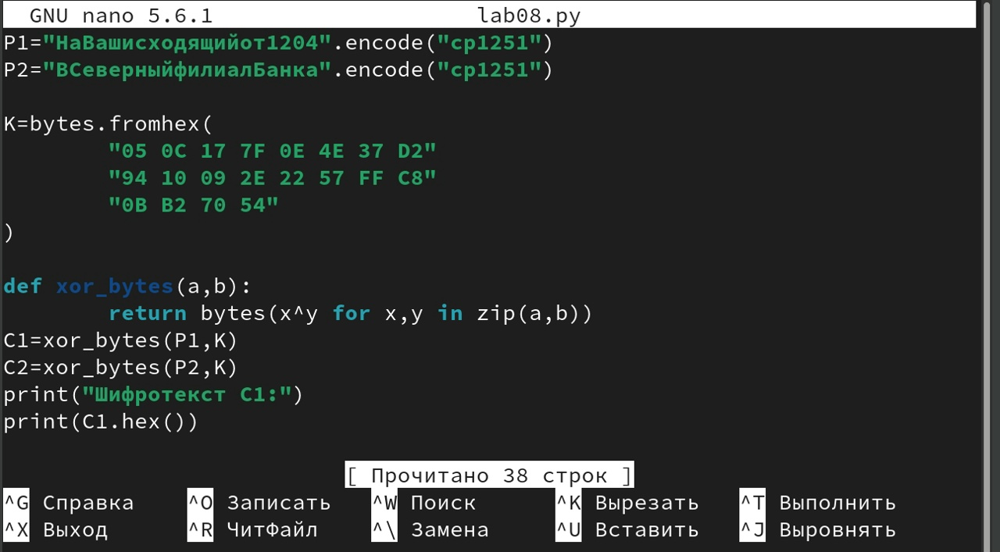

---
## Author
author:
  name: Абронина Алиса Кирилловна
  degrees: DSc
  orcid: 0000-0002-0877-7063
  email: kulyabov-ds@rudn.ru
  affiliation:
    - name: Российский университет дружбы народов
      country: Российская Федерация
      postal-code: 117198
      city: Москва
      address: ул. Миклухо-Маклая, д. 6

## Title
title: "Лабораторная работа № 8"
subtitle: "Элементы криптографии. Шифрование (кодирование) различных исходных текстов одним ключом"
license: "CC BY"
---

# Цель работы

Освоить на практике применение режима однократного гаммирования
на примере кодирования различных исходных текстов одним ключом1.

# Выполнение лабораторной работы

Нужно разоботать приложение, позволяющее шифровать и дешифровать тексты P1 и P2 в режиме однократного гаммирования. Прило-
жение должно определить вид шифротекстов C1 и C2 обоих текстов P1 и
P2 при известном ключе ; Необходимо определить и выразить аналитиче-
ски способ, при котором злоумышленник может прочитать оба текста, не
зная ключа и не стремясь его определить  ([рис. @fig-001]). ([рис. @fig-002]). ([рис. @fig-003]).

{#fig-001 width=70%}

{#fig-002 width=70%}

{#fig-003 width=70%}

# Выводы

Освоила на практике применение режима однократного гаммирования
на примере кодирования различных исходных текстов одним ключом1.

